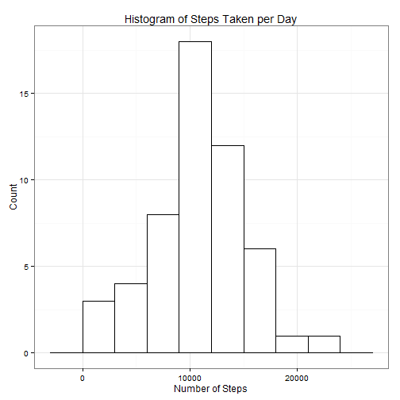
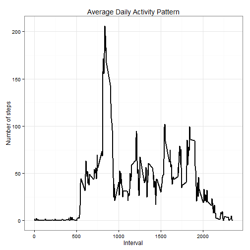
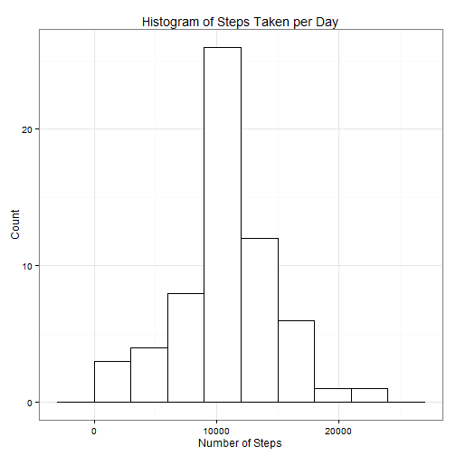

## Overview and goal
The Coursera Course "Reproducible Research" utilizes a data set created from measurements of a personal activity monitoring device.  This device collects data at 5 minute intervals through out the day. The data consists of two months of data from an anonymous individual collected during the months of October and November, 2012 and include the number of steps taken in 5 minute intervals each day.

This script will load the data and perform some basic exploratory data analysis.

## Coding style
I will wrap most of the scripting into functions to make the code more modular and flexible. This can make the code look more complicated at times, but I am convinced it is the right thing to do. Same is true for enclosing if expressions to avoid doing time consuming tasks more often than necessary


## Requirements, loading and preprocessing
1. Zipped Data will be downloaded if necessary
2. It will be unzipped and read in as a data.frame
3. Column types are adjusted (Date column -> date, Interval column -> factor)


```r
## Requirements
library(ggplot2) # For creating nice plots
Sys.setlocale("LC_TIME", "English")
```

```
## [1] "English_United States.1252"
```


```r
## Data acquisition and loading

read_activity_data <- function(){
    
    s_fname <- "activity"
    
    # Is the zip file present? If not, then download!
    if(!file.exists(paste(s_fname, ".zip", sep=""))){
        source_url <- "http://d396qusza40orc.cloudfront.net/repdata%2Fdata%2Factivity.zip"
        download.file(source_url, destfile=paste(s_fname, ".zip", sep=""), method="internal")        
        }
    
    con_csv <- unz(paste(s_fname, ".zip", sep=""), "activity.csv")
    
    
    # Read the file
    
    df_load <- read.csv(con_csv, header=T, colClasses=c("numeric", "character", "numeric"))
    
    df_load$interval <- factor(df_load$interval)
    df_load$date <- as.Date(df_load$date, format="%Y-%m-%d")
    
    
    return(df_load)    
    
    }

## Let's call the function...
df_act <- read_activity_data()

## ... and make sure the data is loaded
summary(df_act)
```

```
##      steps             date               interval    
##  Min.   :  0.00   Min.   :2012-10-01   0      :   61  
##  1st Qu.:  0.00   1st Qu.:2012-10-16   5      :   61  
##  Median :  0.00   Median :2012-10-31   10     :   61  
##  Mean   : 37.38   Mean   :2012-10-31   15     :   61  
##  3rd Qu.: 12.00   3rd Qu.:2012-11-15   20     :   61  
##  Max.   :806.00   Max.   :2012-11-30   25     :   61  
##  NA's   :2304                          (Other):17202
```

The data is now ready for analysis.


## What is mean total number of steps taken per day?

The following code creates a new data.frame that contains the total number of steps for each day.


```r
make_df_total <- function(df_in=df_act){
    df_total <- aggregate(steps ~ date, df_in, sum)
    colnames(df_total) <- c("date", "steps")
    return(df_total)
    }

df_total <- make_df_total()
```


We can now calculate a central tendency for the total number of steps over time, getting the mean or the median:


```r
n_mean <- round(mean(df_total$steps), 2)
n_median <- round(median(df_total$steps), 2)
```

This results in:<br>
1. Mean: 10766.19<br>
2. Median: 10765


The following code creates a histogram of the daily total number of steps taken.


```r
plot_hist <- function(df_in, bin=3000, title="Histogram of Steps Taken per Day") {
    
    ggplot(df_in, aes(x=steps)) + 
        geom_histogram(binwidth=bin, colour="black", fill="white") + 
        labs(title=title, x="Number of Steps", y="Count")+
        theme_bw()
    }


plot_hist(df_total)
```

 


## What is the average daily activity pattern?

The following code creates a plot depicting the average daily pattern of the number of steps (plotted against the measurement interval).


```r
make_df_daily <- function(df_in) {
    df_out<- aggregate(df_in$steps, by=list(interval=df_in$interval),
                       FUN=mean, na.rm=T)
    # Need to convert factor to int for continuos plotting
    df_out$interval <- as.integer(levels(df_out$interval)[df_out$interval])
    colnames(df_out) <- c("interval", "steps")
    return(df_out)
    }

plot_daily_pattern <- function(df_in) {
    
    ggplot(df_in, aes(x=interval, y=steps)) +   
        geom_line(color="black", size=1) +  
        labs(title="Average Daily Activity Pattern", x="Interval", y="Number of steps") +  
        theme_bw()
    
    
    
    }

df_daily <- make_df_daily(df_act)
max_interv <- df_daily[which.max(df_daily$steps),]$interval

plot_daily_pattern(df_daily)
```

 

The **835<sup>th</sup> interval** has the maximum activity on the average.


## Imputing missing values
The data set contains 2304 missing values for the step variable. Since activity usually varies over the course of a day, it makes sense to replace the NAs with the average amount of steps from the same interval from all other days.


```r
na_replacements <- function(df_in, df_defaults=df_daily) {
    v_ids <- which(is.na(df_in$steps))
    v_replacements <- unlist(lapply(v_ids, FUN=function(id){
        return(df_defaults[df_defaults$interval == df_in[id,]$interval,]$steps)
        }))
    v_out <- df_in$steps
    v_out[v_ids] <- v_replacements
    return(v_out)
    }

df_complete <-data.frame(  
    steps = na_replacements(df_act),  
    date = df_act$date,  
    interval = df_act$interval)

df_complete_total <- make_df_total(df_complete)
```
We now have a data.frame with 0 missing values for the step variable. Let's call our histogram plotting function again:


```r
print (summary(df_complete_total))
```

```
##       date                steps      
##  Min.   :2012-10-01   Min.   :   41  
##  1st Qu.:2012-10-16   1st Qu.: 9819  
##  Median :2012-10-31   Median :10766  
##  Mean   :2012-10-31   Mean   :10766  
##  3rd Qu.:2012-11-15   3rd Qu.:12811  
##  Max.   :2012-11-30   Max.   :21194
```

```r
plot_hist(df_complete_total)
```

 

Replacing the NAs with means from other days leads to higher counts in certain bins, especially those close to the center of the graph.

We can also repeat calculations for the central tendency:


```r
n_mean <- round(mean(df_complete_total$steps), 2)
n_median <- round(median(df_complete_total$steps), 2)
```

This time we get:<br>
1. Mean: 10766.19<br>
2. Median: 10766.19

Now the Median is identical to the mean, because all fields formerly containing NA now contain the mean. This is a disadventage of calculating values for NAs.


## Are there differences in activity patterns between weekdays and weekends?

To compare the daily activity on weekdays to those on weekends, we can compute another factor variable with the levels "weekend" and "weekday".
Sadly, my aggregation function above is not that elegant and I am close to the deadline, so I have to use the following workaround:
1. I compute the facotr variable
2. subset two data.frames (grouped by the aformentioned factor we)
3. Icalculate the daily activity with my aggregation function
4. add the we variable anew
5. bind the two data sets 
6. plot that complete set. 

There should be more elegant solutions, but for now this has to suffice.


```r
# Create a factor variable to be able to differentiate between weekdays and weekends 

df_complete$we <- as.factor(sapply(df_complete$date, 
                                   function(x){
                                       if(!(weekdays(x) %in% c('Saturday','Sunday'))){
                                           return("weekday")}
                                       else{
                                           return("weekend")}}))

df_weekdays_complete <- make_df_daily(df_complete[df_complete$we=="weekday",])
df_weekends_complete <- make_df_daily(df_complete[df_complete$we=="weekend",])

df_weekdays_complete$we <- rep("weekday", nrow(df_weekdays_complete))
df_weekends_complete$we <- rep("weekend", nrow(df_weekends_complete))

df_daily_complete <- rbind(df_weekdays_complete, df_weekends_complete)
df_daily_complete$we <- as.factor(df_daily_complete$we)


ggplot(df_daily_complete, 
       aes(x=interval, y=steps)) + 
    geom_line(color="steelblue", size=1) + 
    facet_wrap(~ we, nrow=2, ncol=1) +
    labs(x="Interval", y="Number of steps") +
    theme_bw()
```

 

On weekends, the test subject took more steps during the noon and afternoon than on weekdays. On weekdays he presumably has to work, thus reducing his body activity.


